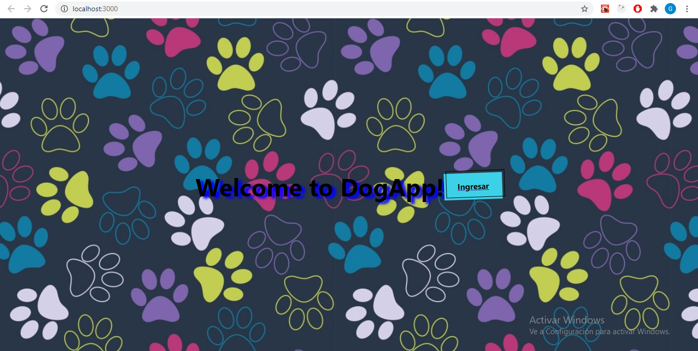
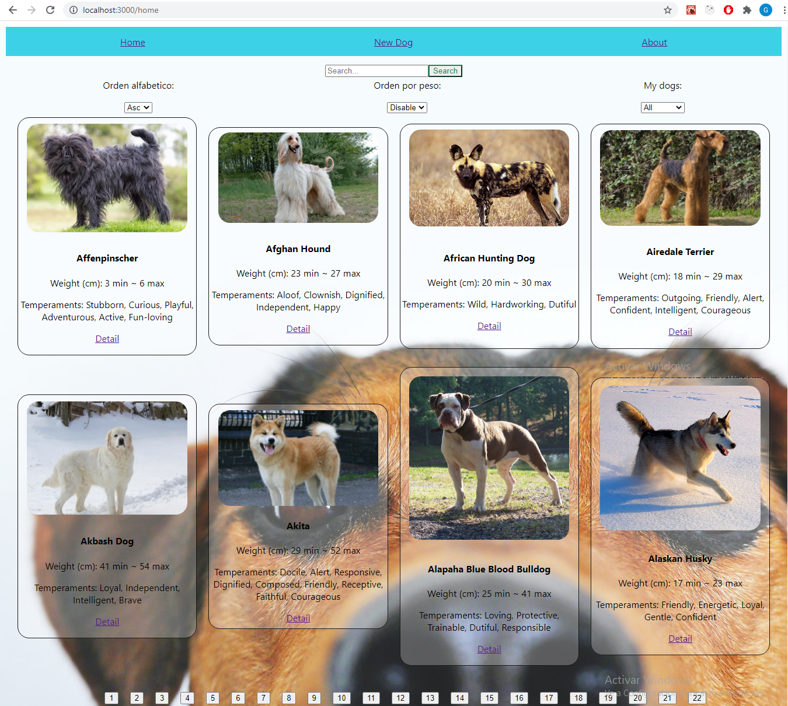
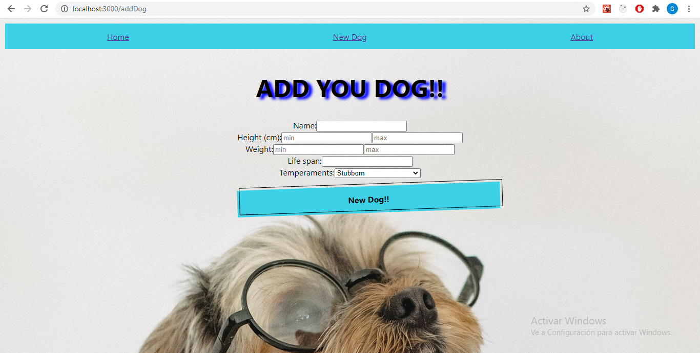
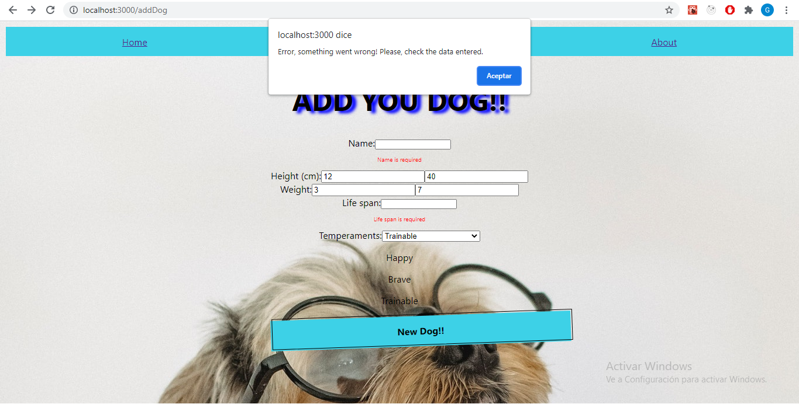

<h1 align="center">Hi 👋, I'm Guido Abelleira</h1>
<h3 align="center">A passionate Full Stack developer from Argentina</h3>

<p align="left">  </p>


## ⚡ Languages and Tools:

<p align="left"> <a href="https://www.w3schools.com/css/" target="_blank">  </a> <a href="https://git-scm.com/" target="_blank">  </a> <a href="https://heroku.com" target="_blank">  </a> <a href="https://www.w3.org/html/" target="_blank">  </a> <a href="https://www.adobe.com/in/products/illustrator.html" target="_blank">  </a> <a href="https://developer.mozilla.org/en-US/docs/Web/JavaScript" target="_blank">  </a> <a href="https://jestjs.io" target="_blank">  </a> <a href="https://mochajs.org" target="_blank">  </a> <a href="https://www.mysql.com/" target="_blank">  </a> <a href="https://nextjs.org/" target="_blank">  </a> <a href="https://nodejs.org" target="_blank">  </a> <a href="https://www.photoshop.com/en" target="_blank">  </a> <a href="https://www.postgresql.org" target="_blank">  </a> <a href="https://postman.com" target="_blank">  </a> <a href="https://reactjs.org/" target="_blank">  </a> <a href="https://reactnative.dev/" target="_blank">  </a> <a href="https://redux.js.org" target="_blank">  </a> <a href="https://www.typescriptlang.org/" target="_blank">  </a> </p>

```javascript
const skills = {
    technologies: {
       frontEnd: {
          javaScript: ["React", "Redux"],
       },
       backEnd: {
          javaScript: ["Node", "Express", "Sequelize"],
       },
       databases: ["PostgreSQL", "MariaDB", "MySql"],
    },
 }; 
 ```

## 🔭 I’m currently working on [E-commerce-PF10](https://github.com/guidoabelleira/E-Commerce-PF10)

## 🌱 My Proyects:

<h4 align="center"> Individual Project - Henry Dogs App </h4>
<p>Application made based on the knowledge acquired in bootcamp "Henry". The app works with an external API
which provides data on breeds of
dogs, in turn the user can
create your own breed of dog. I know
implemented filters to separate
the races coming from the API and from
our own database, like this
also, in alphabetical order, weight
ascending and descending. Applied
a page of 8 cards without
Hooks implementation.</p>
<p>
Simple Landing Page:
</p>

<p>
Home: Search bar. Filters by weight, alphabetic & API/DB
</p>

<p>
Controlled form:
</p>



<h3 align="left">Connect with me:</h3>
<p align="left">
<a href="https://linkedin.com/in/guidoabelleira" target="blank"></a>
</p>

- 📫 How to reach me **guidoabelleira@gmail.com**

<p></p>


<p></p>
